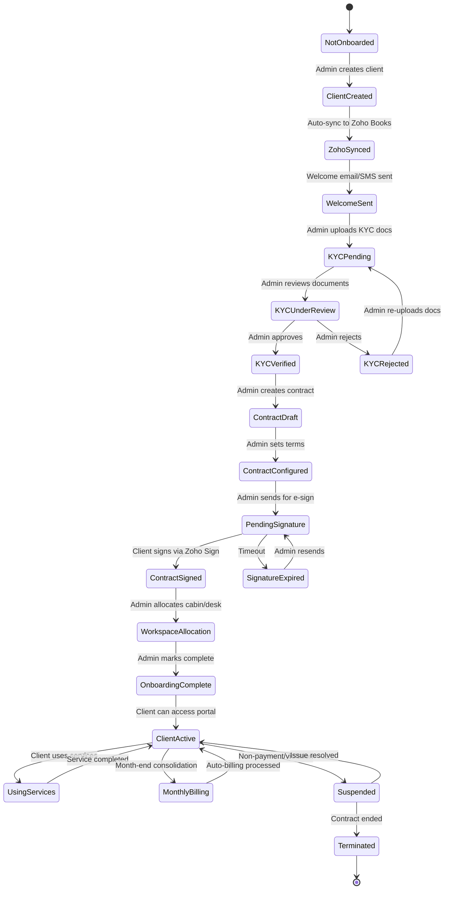
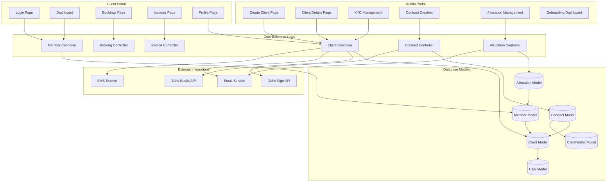

# User Onboarding Journey - Complete UML Documentation
## Admin-Driven Client Onboarding Flow

## Complete User Onboarding Sequence Diagram

```mermaid
sequenceDiagram
    participant Admin as Admin User
    participant Portal as Admin Portal
    participant Backend as Backend API
    participant DB as MongoDB
    participant Zoho as Zoho Books
    participant ZohoSign as Zoho Sign
    participant Email as Email Service
    participant SMS as SMS Service
    participant Client as Client User

    Note over Admin,Client: Phase 1: Admin Creates Client Account
    Admin->>Portal: Login to admin portal
    Admin->>Portal: Navigate to "Create Client"
    Portal->>Admin: Display client onboarding form
    Admin->>Portal: Enter client details (Step 1: Basic Info)
    Note right of Admin: Company name, legal name<br/>Contact person, email, phone<br/>Website, industry, address
    
    Admin->>Portal: Enter commercial details (Step 2)
    Note right of Admin: Contact type, customer sub-type<br/>Credit limit, payment terms<br/>Portal access, notes
    
    Admin->>Portal: Enter address details (Step 3)
    Note right of Admin: Billing address<br/>Shipping address<br/>"Same as billing" option
    
    Admin->>Portal: Enter contact persons (Step 4)
    Note right of Admin: Multiple contacts with<br/>Primary contact selection<br/>Portal access flags
    
    Admin->>Portal: Submit client creation form
    Portal->>Backend: POST /clients (with all details)
    
    Backend->>DB: Check if email/phone exists
    alt Client already exists
        DB-->>Backend: Client found
        Backend-->>Portal: 400 Error: Client exists
        Portal->>Admin: Show error message
    else New client
        DB-->>Backend: No existing client
        Backend->>DB: Create User document (for client login)
        Backend->>DB: Create Client document (with all details)
        Backend->>DB: Create Member document (linked to client)
        DB-->>Backend: Documents created
        
        Note over Backend,Zoho: Auto-sync to Zoho Books
        Backend->>Zoho: POST /contacts (create contact)
        Note right of Backend: Maps all client fields:<br/>- Company name → contact name<br/>- Primary contact → contact person<br/>- Addresses → billing/shipping<br/>- GST, payment terms, etc.
        Zoho-->>Backend: Contact created with contact_id
        Backend->>DB: Update Client.zohoBooksContactId
        
        Note over Backend,Email: Send Welcome Communications
        Backend->>Email: Send welcome email to client
        Email-->>Client: Welcome email with login credentials
        Backend->>SMS: Send welcome SMS
        SMS-->>Client: Welcome SMS notification
        
        Backend-->>Portal: 201 Created + client details
        Portal->>Admin: Show success + client ID
    end

    Note over Admin,Client: Phase 2: KYC Document Upload
    Admin->>Portal: Navigate to client details page
    Admin->>Portal: Click "Upload KYC Documents"
    Portal->>Admin: Display KYC upload form
    Admin->>Portal: Upload documents (PAN, GST, Address proof, etc.)
    Portal->>Backend: POST /clients/:id/kyc-documents
    Backend->>DB: Store document URLs in Client.kycDocuments
    Backend->>DB: Set kycStatus = 'submitted'
    DB-->>Backend: Documents saved
    Backend-->>Portal: 200 OK
    Portal->>Admin: Show "KYC documents uploaded"
    
    Note over Admin,Client: Phase 3: KYC Verification
    Admin->>Portal: Review KYC documents
    Admin->>Portal: Verify documents (approve/reject)
    Admin->>Backend: PUT /clients/:id/kyc-status
    Backend->>DB: Update kycStatus = 'verified'
    Backend->>DB: Set kycVerifiedAt = now()
    
    alt KYC Approved
        Backend->>Email: Send KYC approval email
        Email-->>Client: KYC approved notification
        Backend->>SMS: Send KYC approval SMS
        SMS-->>Client: KYC approved SMS
        Backend-->>Portal: 200 OK
        Portal->>Admin: Show "KYC verified successfully"
    else KYC Rejected
        Backend->>Email: Send KYC rejection email with reason
        Email-->>Client: KYC rejected notification
        Backend-->>Portal: KYC rejected
        Portal->>Admin: Show rejection confirmation
    end

    Note over Admin,Client: Phase 4: Contract Creation & Configuration
    Admin->>Portal: Navigate to "Create Contract"
    Portal->>Admin: Display contract form
    Admin->>Portal: Enter contract details
    Note right of Admin: - Workspace allocation<br/>- Pricing (monthly/annual)<br/>- Credit allocation<br/>- Contract terms & duration<br/>- Start/end dates
    
    Admin->>Portal: Submit contract form
    Portal->>Backend: POST /contracts
    Backend->>DB: Create Contract document
    Backend->>DB: Link contract to client
    
    alt Credit-enabled contract
        Backend->>DB: Create ClientCreditWallet
        Backend->>DB: Set allocated_credits
        DB-->>Backend: Wallet created
    end
    
    Backend->>DB: Set contract status = 'draft'
    DB-->>Backend: Contract created
    Backend-->>Portal: 201 Created + contract details
    Portal->>Admin: Show "Contract created successfully"

    Note over Admin,Client: Phase 5: Send Contract for E-Signature
    Admin->>Portal: Click "Send for Signature" on contract
    Portal->>Backend: POST /contracts/:id/send-for-signature
    Backend->>Backend: Generate contract PDF
    Backend->>ZohoSign: POST /documents (upload contract)
    ZohoSign-->>Backend: Document ID
    Backend->>ZohoSign: POST /recipients (add client as signer)
    ZohoSign-->>Backend: Request ID
    Backend->>ZohoSign: POST /submit (send for signature)
    ZohoSign-->>Backend: Signature request sent
    
    Backend->>DB: Update contract
    Note right of Backend: - zohoSignRequestId<br/>- status = 'pending_signature'<br/>- sentForSignatureAt = now()
    
    Backend->>Email: Send signature request email
    Email-->>Client: Contract signature link
    Backend->>SMS: Send signature notification SMS
    SMS-->>Client: "Contract ready for signature"
    Backend-->>Portal: 200 OK
    Portal->>Admin: Show "Signature request sent"
    
    Note over Client,ZohoSign: Client Signs Contract
    Client->>Email: Click signature link
    Client->>ZohoSign: Open contract in Zoho Sign
    ZohoSign->>Client: Display contract for review
    Client->>ZohoSign: Sign contract digitally
    ZohoSign->>Backend: Webhook: document.signed
    Backend->>DB: Update contract
    Note right of Backend: - status = 'active'<br/>- signedAt = now()
    Backend->>Email: Send contract activation email
    Email-->>Client: "Contract activated" notification
    Email-->>Admin: "Contract signed" notification
    Backend->>SMS: Send activation SMS
    SMS-->>Client: "Contract active" SMS

    Note over Admin,Client: Phase 6: Cabin/Workspace Allocation
    Admin->>Portal: Navigate to "Allocations"
    Admin->>Portal: Select client and contract
    Portal->>Admin: Display allocation form
    Admin->>Portal: Select workspace details
    Note right of Admin: - Building<br/>- Floor<br/>- Cabin/Desk number<br/>- Allocation date<br/>- Access permissions
    
    Admin->>Portal: Submit allocation
    Portal->>Backend: POST /allocations
    Backend->>DB: Create Allocation document
    Backend->>DB: Link allocation to member
    Backend->>DB: Update member.workspace details
    Backend->>DB: Generate access QR code
    DB-->>Backend: Allocation created
    
    Backend->>Email: Send workspace details email
    Email-->>Client: Workspace allocation with QR code
    Backend->>SMS: Send allocation SMS
    SMS-->>Client: "Workspace allocated" notification
    Backend-->>Portal: 201 Created
    Portal->>Admin: Show "Allocation successful"

    Note over Admin,Client: Phase 7: Onboarding Complete
    Admin->>Portal: Mark onboarding as complete
    Portal->>Backend: PUT /clients/:id/onboarding-status
    Backend->>DB: Update client.onboardingStatus = 'completed'
    Backend->>DB: Set client.onboardedAt = now()
    Backend->>Email: Send onboarding completion email
    Email-->>Client: "Welcome to workspace" email
    Note right of Email: - Login credentials<br/>- Workspace details<br/>- Access instructions<br/>- Portal guide
    Backend-->>Portal: 200 OK
    Portal->>Admin: Show "Onboarding completed"
    
    Note over Client: Client Can Now Access Portal
    Client->>Portal: Login to client portal
    Client->>Portal: View workspace, bookings, invoices
    Client->>Portal: Use services (meeting rooms, day pass, etc.)
```

## Admin-Driven Onboarding State Machine

## Component Architecture Diagram

## Admin-Driven Data Flow

```mermaid
flowchart TD
    Start([Admin Logs In]) --> A[Navigate to Create Client]
    
    A --> B[Fill Client Form - Step 1]
    B --> C[Basic Info: Company, Contact, Email, Phone]
    C --> D[Fill Step 2: Commercial Details]
    D --> E[Credit Limit, Payment Terms, Notes]
    E --> F[Fill Step 3: Addresses]
    F --> G[Billing & Shipping Address]
    G --> H[Fill Step 4: Contact Persons]
    H --> I[Primary + Additional Contacts]
    
    I --> J[Submit Client Creation]
    J --> K[Create User + Client + Member]
    K --> L[Auto-sync to Zoho Books]
    L --> M[Send Welcome Email/SMS to Client]
    
    M --> N[Admin Uploads KYC Documents]
    N --> O[Store KYC in Client Record]
    O --> P[Admin Reviews KYC]
    
    P --> Q{KYC Approved?}
    Q -->|No| R[Reject with Reason]
    R --> N
    
    Q -->|Yes| S[Mark KYC Verified]
    S --> T[Send KYC Approval Notification]
    
    T --> U[Admin Creates Contract]
    U --> V[Set Workspace, Pricing, Credits]
    V --> W[Create Contract Record]
    
    W --> X{Credit Enabled?}
    X -->|Yes| Y[Create Credit Wallet]
    X -->|No| Z[Skip Wallet]
    
    Y --> AA[Admin Sends for E-Signature]
    Z --> AA
    
    AA --> AB[Upload to Zoho Sign]
    AB --> AC[Send Signature Request to Client]
    AC --> AD{Client Signs?}
    
    AD -->|No| AE[Wait/Resend]
    AE --> AD
    
    AD -->|Yes| AF[Zoho Sign Webhook]
    AF --> AG[Update Contract Status: Active]
    AG --> AH[Send Activation Notification]
    
    AH --> AI[Admin Allocates Workspace]
    AI --> AJ[Select Building, Cabin, Desk]
    AJ --> AK[Create Allocation Record]
    AK --> AL[Generate Access QR Code]
    AL --> AM[Send Workspace Details to Client]
    
    AM --> AN[Admin Marks Onboarding Complete]
    AN --> AO[Update Client Status: Active]
    AO --> AP[Send Completion Email]
    
    AP --> AQ[Client Can Access Portal]
    AQ --> AR[Client Uses Services]
    AR --> AS[Track Usage & Credits]
    AS --> AT{Month End?}
    
    AT -->|Yes| AU[Auto-consolidate Usage]
    AU --> AV[Generate Invoice]
    AV --> AW[Sync to Zoho Books]
    AW --> AX[Send Invoice to Client]
    
    AT -->|No| AR
```

## Admin-Driven Onboarding Timeline

```mermaid
gantt
    title Admin-Driven Client Onboarding Timeline
    dateFormat X
    axisFormat %s
    
    section Phase 1: Client Creation
    Admin fills 4-step form          :0, 2
    Create User/Client/Member        :2, 3
    Auto-sync to Zoho Books         :3, 4
    Send Welcome Email/SMS          :4, 5
    
    section Phase 2: KYC
    Admin uploads KYC docs          :5, 7
    Admin reviews documents         :7, 9
    KYC Approval/Rejection          :9, 10
    Send KYC notification           :10, 11
    
    section Phase 3: Contract
    Admin creates contract          :11, 13
    Configure pricing & credits     :13, 14
    Create credit wallet            :14, 15
    
    section Phase 4: E-Signature
    Admin sends for signature       :15, 16
    Upload to Zoho Sign             :16, 17
    Client receives email           :17, 18
    Client signs contract           :18, 20
    Zoho Sign webhook               :20, 21
    Contract activated              :21, 22
    
    section Phase 5: Allocation
    Admin allocates workspace       :22, 24
    Generate QR code                :24, 25
    Send workspace details          :25, 26
    
    section Phase 6: Completion
    Admin marks complete            :26, 27
    Send completion email           :27, 28
    Client portal access            :28, 30
```

## Admin Decision Points

```mermaid
flowchart LR
    A[Admin Creates Client] --> B{Client<br/>Exists?}
    B -->|Yes| C[Show Error]
    B -->|No| D[Create & Sync to Zoho]
    
    D --> E[Admin Uploads KYC]
    E --> F{KYC<br/>Valid?}
    F -->|No| G[Reject & Notify]
    F -->|Yes| H[Approve KYC]
    
    H --> I[Admin Creates Contract]
    I --> J{Credit<br/>Enabled?}
    J -->|Yes| K[Create Wallet]
    J -->|No| L[Skip Wallet]
    
    K --> M[Send for E-Sign]
    L --> M
    
    M --> N{Client<br/>Signs?}
    N -->|No| O[Wait/Resend]
    N -->|Yes| P[Contract Active]
    
    P --> Q[Admin Allocates Workspace]
    Q --> R[Generate QR Code]
    R --> S[Admin Marks Complete]
    
    S --> T[Client Active]
    T --> U{Using<br/>Services?}
    U -->|Yes| V[Track Usage]
    U -->|No| W[Idle]
    
    V --> X{Month<br/>End?}
    X -->|Yes| Y[Auto-bill]
    X -->|No| V
```

## Integration Points Summary

| Phase | System | Action | Trigger | Actor |
|-------|--------|--------|---------|-------|
| Client Creation | Zoho Books | Create Contact | Admin submits form | Admin |
| Client Creation | Email | Welcome Email | Account created | System |
| Client Creation | SMS | Welcome SMS | Account created | System |
| KYC Upload | Database | Store Documents | Admin uploads | Admin |
| KYC Verification | Email/SMS | Approval Notification | Admin approves | Admin |
| Contract Creation | Database | Create Contract | Admin submits | Admin |
| Contract Creation | Database | Create Credit Wallet | Credit enabled | System |
| E-Signature | Zoho Sign | Upload Document | Admin sends | Admin |
| E-Signature | Zoho Sign | Add Recipient | Document uploaded | System |
| E-Signature | Email | Signature Request | Zoho Sign | System |
| E-Signature | Webhook | Signature Complete | Client signs | Client |
| E-Signature | Email/SMS | Activation Notice | Contract signed | System |
| Allocation | Database | Create Allocation | Admin allocates | Admin |
| Allocation | Database | Generate QR Code | Allocation created | System |
| Allocation | Email | Workspace Details | QR generated | System |
| Completion | Database | Update Status | Admin marks complete | Admin |
| Completion | Email | Welcome Package | Status updated | System |

## Client States & Access Permissions

| State | Admin Actions | Client Portal Access | Can Book Services | Notes |
|-------|---------------|---------------------|-------------------|-------|
| Created | Upload KYC, Create Contract | ❌ | ❌ | Just created, no access yet |
| KYC Submitted | Review & Approve/Reject | ❌ | ❌ | Awaiting admin review |
| KYC Verified | Create Contract | ❌ | ❌ | Ready for contract |
| Contract Draft | Configure & Send for Sign | ❌ | ❌ | Contract being prepared |
| Pending Signature | Resend signature request | ✅ (View only) | ❌ | Client can view, must sign |
| Contract Signed | Allocate Workspace | ✅ (View only) | ❌ | Awaiting workspace |
| Workspace Allocated | Mark onboarding complete | ✅ (Limited) | ❌ | Almost ready |
| Onboarding Complete | Manage client | ✅ (Full) | ✅ | Fully active client |
| Suspended | Reactivate | ✅ (View only) | ❌ | Payment/violation issue |
| Terminated | Archive/Delete | ❌ | ❌ | Contract ended |

## Onboarding Checklist

### Admin Tasks (Sequential)

1. **Client Creation** ✓
   - Fill 4-step form (Basic, Commercial, Address, Contacts)
   - Auto-sync to Zoho Books
   - Welcome email/SMS sent

2. **KYC Management** ✓
   - Upload KYC documents (PAN, GST, Address proof)
   - Review documents
   - Approve/Reject with reason

3. **Contract Setup** ✓
   - Create contract with pricing
   - Configure workspace allocation
   - Set credit allocation (if applicable)
   - Create credit wallet (if enabled)

4. **E-Signature** ✓
   - Send contract for digital signature
   - Upload to Zoho Sign
   - Client receives email
   - Wait for client signature
   - Webhook confirms signing

5. **Workspace Allocation** ✓
   - Select building, floor, cabin/desk
   - Create allocation record
   - Generate access QR code
   - Send workspace details

6. **Onboarding Completion** ✓
   - Mark client as onboarded
   - Send welcome package email
   - Grant full portal access

### Client Actions (Minimal)

1. **Receive Welcome Email** - Check credentials
2. **Sign Contract** - Via Zoho Sign email link
3. **Access Portal** - After onboarding complete
4. **Use Services** - Book meetings, day passes, etc.
