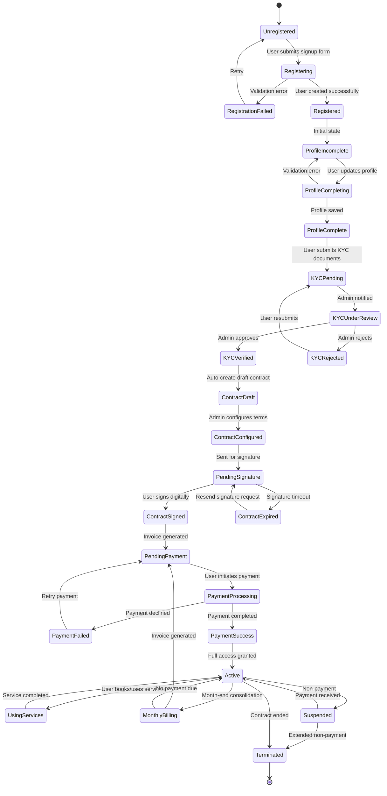
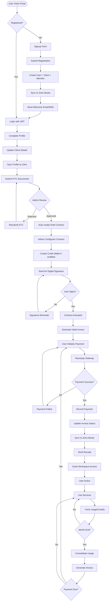
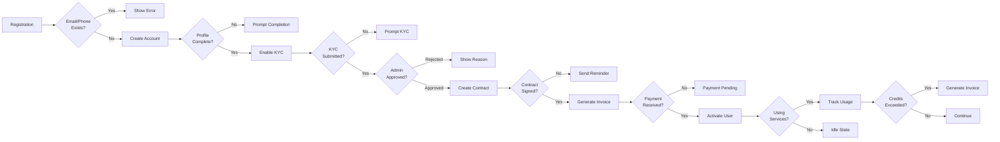

# User Onboarding Journey - Complete UML Documentation

## Complete User Onboarding Sequence Diagram

```mermaid
sequenceDiagram
    participant User as New User
    participant Portal as Client Portal
    participant Auth as Auth System
    participant Backend as Backend API
    participant DB as MongoDB
    participant Zoho as Zoho Books
    participant Email as Email Service
    participant SMS as SMS Service

    Note over User,SMS: Phase 1: Initial Registration
    User->>Portal: Access signup page
    Portal->>User: Display registration form
    User->>Portal: Enter details (name, email, phone, company)
    Portal->>Backend: POST /auth/register
    
    Backend->>DB: Check if email/phone exists
    alt User already exists
        DB-->>Backend: User found
        Backend-->>Portal: 400 Error: User exists
        Portal->>User: Show error message
    else New user
        DB-->>Backend: No existing user
        Backend->>DB: Create User document
        Backend->>DB: Create Role (default: client)
        Backend->>DB: Create Client document
        Backend->>DB: Create Member document (linked to client)
        DB-->>Backend: Documents created
        
        Note over Backend,Zoho: Sync to Zoho Books
        Backend->>Zoho: POST /contacts (create contact)
        Zoho-->>Backend: Contact created with zoho_contact_id
        Backend->>DB: Update Client with zohoBooksContactId
        
        Note over Backend,Email: Send Welcome Communications
        Backend->>Email: Send welcome email
        Email-->>User: Welcome email received
        Backend->>SMS: Send welcome SMS
        SMS-->>User: Welcome SMS received
        
        Backend->>Auth: Generate JWT token
        Auth-->>Backend: JWT token with user, client, member IDs
        Backend-->>Portal: 201 Created + JWT token + user object
        Portal->>Portal: Store token in localStorage
        Portal->>Portal: Store user object in localStorage
        Portal->>User: Redirect to dashboard
    end

    Note over User,SMS: Phase 2: Profile Completion
    User->>Portal: Navigate to profile page
    Portal->>Backend: GET /clients/me (with JWT)
    Backend->>DB: Find client by clientId from token
    DB-->>Backend: Return client data
    Backend-->>Portal: Client profile data
    Portal->>User: Display profile form (pre-filled)
    
    User->>Portal: Update profile (company details, address, GST)
    Portal->>Backend: PUT /clients/:id
    Backend->>DB: Update Client document
    Backend->>Zoho: PUT /contacts/:id (sync updates)
    Zoho-->>Backend: Contact updated
    Backend-->>Portal: 200 OK + updated client
    Portal->>User: Show success message

    Note over User,SMS: Phase 3: KYC Verification
    User->>Portal: Navigate to KYC section
    Portal->>User: Display KYC form
    User->>Portal: Upload documents (PAN, GST, Address proof)
    Portal->>Backend: POST /clients/:id/kyc-documents
    Backend->>DB: Store document URLs in Client.kycDocuments
    Backend->>DB: Set kycStatus = 'pending'
    DB-->>Backend: Documents saved
    Backend-->>Portal: 200 OK
    Portal->>User: Show "KYC submitted, pending review"
    
    Note over Backend,Email: Admin Review Process
    Backend->>Email: Notify admin of new KYC submission
    
    Note over User,SMS: Admin Reviews KYC
    Admin->>Portal: Review KYC documents
    Admin->>Backend: PUT /clients/:id/kyc-status
    Backend->>DB: Update kycStatus = 'verified'
    Backend->>DB: Set kycVerifiedAt = now()
    
    alt KYC Approved
        Backend->>Email: Send KYC approval email
        Email-->>User: KYC approved notification
        Backend->>SMS: Send KYC approval SMS
        SMS-->>User: KYC approved SMS
        
        Note over Backend,DB: Auto-create draft contract
        Backend->>DB: Create Contract document (status: draft)
        DB-->>Backend: Contract created
    else KYC Rejected
        Backend->>Email: Send KYC rejection email with reason
        Email-->>User: KYC rejected notification
        Backend-->>Portal: KYC rejected
        Portal->>User: Show rejection reason
    end

    Note over User,SMS: Phase 4: Contract Setup
    User->>Portal: View contracts section
    Portal->>Backend: GET /contracts?clientId=xxx
    Backend->>DB: Find contracts for client
    DB-->>Backend: Return contracts (including draft)
    Backend-->>Portal: Contracts list
    Portal->>User: Display draft contract
    
    Admin->>Portal: Configure contract details
    Admin->>Backend: PUT /contracts/:id
    Backend->>DB: Update contract (workspace, pricing, credits)
    Backend->>DB: Create ClientCreditWallet if credit_enabled
    DB-->>Backend: Contract and wallet created
    Backend-->>Portal: 200 OK
    
    Note over Backend,Zoho: Send for Digital Signature
    Admin->>Backend: POST /contracts/:id/send-for-signature
    Backend->>Zoho: POST /sign/documents (Zoho Sign API)
    Zoho-->>Backend: Document ID + signature request ID
    Backend->>DB: Update contract (zohoSignRequestId, status: pending_signature)
    Backend->>Email: Send signature request email
    Email-->>User: Contract signature link
    
    User->>Email: Click signature link
    User->>Zoho: Sign contract digitally
    Zoho->>Backend: Webhook: signature_completed
    Backend->>DB: Update contract (status: active, signedAt)
    Backend->>Email: Send contract activation email
    Email-->>User: Contract activated notification

    Note over User,SMS: Phase 5: Payment & Activation
    User->>Portal: View invoices section
    Portal->>Backend: GET /invoices?clientId=xxx
    Backend->>DB: Find invoices for client
    DB-->>Backend: Return invoices (including contract invoice)
    Backend-->>Portal: Invoices list
    Portal->>User: Display pending invoice
    
    User->>Portal: Click "Pay Now"
    Portal->>Backend: POST /payments/razorpay/create-order
    Backend->>Backend: Calculate amount (invoice total + GST)
    Backend->>Razorpay: Create payment order
    Razorpay-->>Backend: Order ID + payment details
    Backend-->>Portal: Razorpay config
    
    Portal->>User: Open Razorpay payment gateway
    User->>Razorpay: Complete payment (card/UPI/netbanking)
    Razorpay->>Portal: Payment success callback
    Portal->>Backend: POST /payments/razorpay/success
    
    Backend->>Razorpay: Verify payment signature
    Razorpay-->>Backend: Signature valid
    Backend->>DB: Create Payment document
    Backend->>DB: Update Invoice (status: paid, amount_paid)
    Backend->>DB: Update Contract (status: active if not already)
    
    Note over Backend,Zoho: Sync payment to Zoho Books
    Backend->>Zoho: POST /invoices (create invoice)
    Zoho-->>Backend: Invoice created with zoho_invoice_id
    Backend->>Zoho: POST /customerpayments (record payment)
    Zoho-->>Backend: Payment recorded
    Backend->>DB: Update Invoice with zohoInvoiceId
    
    Backend->>Email: Send payment receipt
    Email-->>User: Payment confirmation email
    Backend->>SMS: Send payment confirmation SMS
    SMS-->>User: Payment confirmation SMS
    Backend-->>Portal: 200 OK + payment details
    Portal->>User: Show payment success

    Note over User,SMS: Phase 6: Workspace Access
    User->>Portal: Navigate to dashboard
    Portal->>Backend: GET /member-portal/me
    Backend->>DB: Find Member by memberId from token
    DB-->>Backend: Return member with workspace details
    Backend-->>Portal: Member profile + workspace info
    Portal->>User: Display workspace details (desk, cabin, building)
    
    User->>Portal: View bookings section
    Portal->>Backend: GET /member-portal/me/bookings
    Backend->>DB: Find bookings for member
    DB-->>Backend: Return bookings (meeting rooms, day passes)
    Backend-->>Portal: Bookings list
    Portal->>User: Display active bookings
    
    User->>Portal: Create new booking (meeting room)
    Portal->>Backend: POST /bookings/meeting-rooms
    Backend->>DB: Check availability
    Backend->>DB: Create Booking document
    Backend->>DB: Generate QR code for check-in
    DB-->>Backend: Booking created
    Backend->>Email: Send booking confirmation
    Email-->>User: Booking confirmation with QR
    Backend-->>Portal: 200 OK + booking details
    Portal->>User: Show booking success

    Note over User,SMS: Phase 7: Ongoing Usage
    User->>Portal: Use services (day pass, meeting rooms, credits)
    Portal->>Backend: Various API calls for services
    Backend->>DB: Track usage, consume credits
    Backend->>DB: Create invoices for exceeded usage
    
    Note over Backend,Email: Month-end Billing
    Backend->>Backend: Cron job: consolidate monthly usage
    Backend->>DB: Calculate exceeded credits
    Backend->>DB: Create consolidated invoice
    Backend->>Zoho: Sync invoice to Zoho Books
    Backend->>Email: Send invoice to client
    Email-->>User: Monthly invoice email
    
    User->>Portal: View and pay invoice
    Note right of User: Payment flow repeats from Phase 5
```

## User Onboarding State Machine

## Component Architecture Diagram

```mermaid
graph TB
    subgraph "Frontend - Client Portal"
        A1[Signup Page]
        A2[Profile Page]
        A3[KYC Upload Page]
        A4[Contracts Page]
        A5[Invoices Page]
        A6[Dashboard]
        A7[Bookings Page]
    end
    
    subgraph "Authentication Layer"
        B1[Auth Controller]
        B2[JWT Service]
        B3[OTP Service]
        B4[Universal Auth Middleware]
    end
    
    subgraph "Core Business Logic"
        C1[Client Controller]
        C2[Member Controller]
        C3[Contract Controller]
        C4[Invoice Controller]
        C5[Payment Controller]
        C6[Booking Controller]
        C7[Credit Controller]
    end
    
    subgraph "External Integrations"
        D1[Zoho Books API]
        D2[Zoho Sign API]
        D3[Razorpay Gateway]
        D4[Email Service]
        D5[SMS Service]
    end
    
    subgraph "Database Models"
        E1[(User Model)]
        E2[(Client Model)]
        E3[(Member Model)]
        E4[(Contract Model)]
        E5[(Invoice Model)]
        E6[(Payment Model)]
        E7[(Booking Model)]
        E8[(CreditWallet Model)]
    end
    
    subgraph "Background Jobs"
        F1[Credit Consolidation Cron]
        F2[Invoice Generation Cron]
        F3[Contract Expiry Check]
        F4[Payment Reminder Cron]
    end
    
    A1 --> B1
    A2 --> C1
    A3 --> C1
    A4 --> C3
    A5 --> C4
    A6 --> C2
    A7 --> C6
    
    B1 --> B2
    B1 --> B3
    B4 --> E1
    B4 --> E2
    B4 --> E3
    
    C1 --> E2
    C1 --> D1
    C1 --> D4
    C2 --> E3
    C3 --> E4
    C3 --> D2
    C4 --> E5
    C4 --> D1
    C5 --> E6
    C5 --> D3
    C5 --> D1
    C6 --> E7
    C7 --> E8
    
    F1 --> C7
    F2 --> C4
    F3 --> C3
    F4 --> D4
    F4 --> D5
```

## Data Flow - Complete Onboarding

## Key Milestones & Touchpoints

```mermaid
gantt
    title User Onboarding Timeline
    dateFormat X
    axisFormat %s
    
    section Registration
    Signup Form Submission           :0, 1
    Account Creation                 :1, 2
    Zoho Sync                       :2, 3
    Welcome Email/SMS               :3, 4
    
    section Profile Setup
    Login & Profile Access          :4, 5
    Complete Profile Details        :5, 7
    Profile Sync to Zoho           :7, 8
    
    section KYC Process
    Submit KYC Documents            :8, 10
    Admin Review (1-2 days)         :10, 12
    KYC Approval Notification       :12, 13
    
    section Contract
    Draft Contract Creation         :13, 14
    Admin Configuration             :14, 16
    Send for Signature              :16, 17
    User Signs Contract             :17, 19
    Contract Activation             :19, 20
    
    section Payment
    Invoice Generation              :20, 21
    Payment Initiation              :21, 22
    Payment Processing              :22, 23
    Payment Confirmation            :23, 24
    Zoho Books Sync                 :24, 25
    
    section Activation
    Workspace Access Granted        :25, 26
    User Fully Active               :26, 30
```

## Critical Decision Points

## Integration Points Summary

| Phase | System | Action | Trigger |
|-------|--------|--------|---------|
| Registration | Zoho Books | Create Contact | User signup |
| Registration | Email | Welcome Email | Account created |
| Registration | SMS | Welcome SMS | Account created |
| Profile | Zoho Books | Update Contact | Profile updated |
| KYC | Email | Admin Notification | KYC submitted |
| KYC | Email/SMS | Approval/Rejection | Admin decision |
| Contract | Zoho Sign | Send for Signature | Admin action |
| Contract | Email | Signature Request | Zoho Sign API |
| Contract | Webhook | Signature Status | User signs |
| Payment | Razorpay | Payment Gateway | User initiates |
| Payment | Zoho Books | Create Invoice | Payment success |
| Payment | Zoho Books | Record Payment | Payment success |
| Payment | Email | Receipt | Payment confirmed |
| Billing | Zoho Books | Monthly Invoice | Cron job |
| Billing | Email | Invoice Notification | Invoice created |

## User States & Permissions

| State | Can Login | Can View Profile | Can Book Services | Can Make Payments | Notes |
|-------|-----------|------------------|-------------------|-------------------|-------|
| Registered | ✅ | ✅ | ❌ | ❌ | Basic access only |
| Profile Complete | ✅ | ✅ | ❌ | ❌ | Can submit KYC |
| KYC Pending | ✅ | ✅ | ❌ | ❌ | Waiting for review |
| KYC Verified | ✅ | ✅ | ❌ | ❌ | Contract pending |
| Contract Signed | ✅ | ✅ | ❌ | ✅ | Payment pending |
| Active | ✅ | ✅ | ✅ | ✅ | Full access |
| Suspended | ✅ | ✅ | ❌ | ✅ | Payment overdue |
| Terminated | ❌ | ❌ | ❌ | ❌ | Contract ended |
